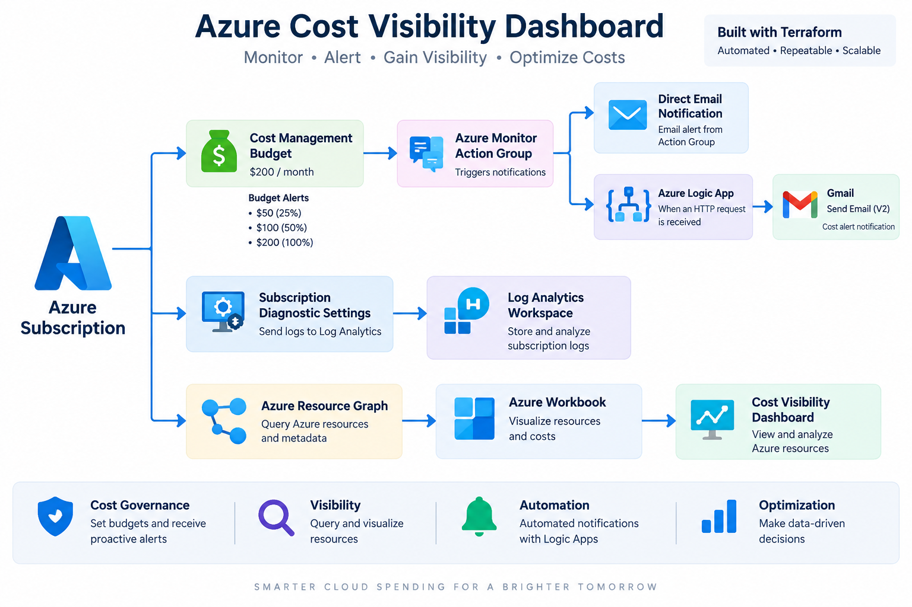
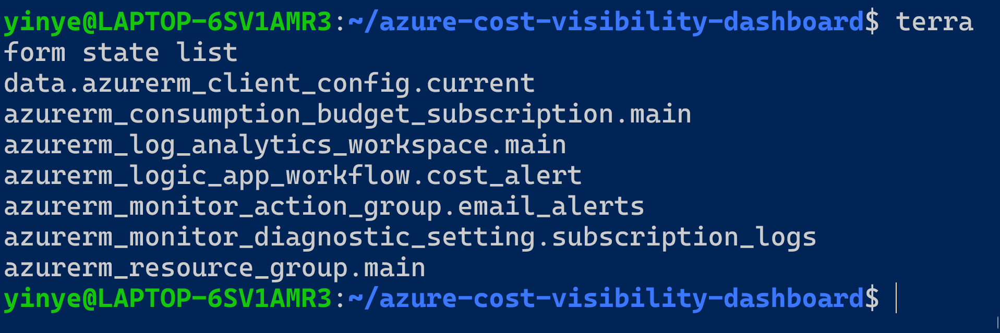
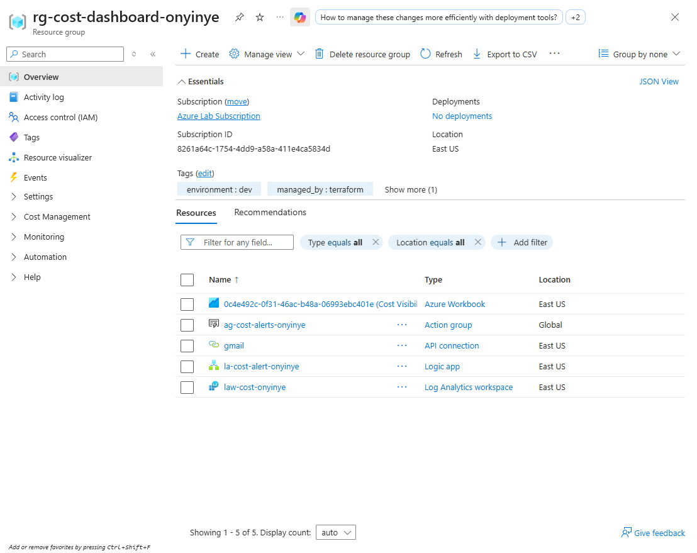
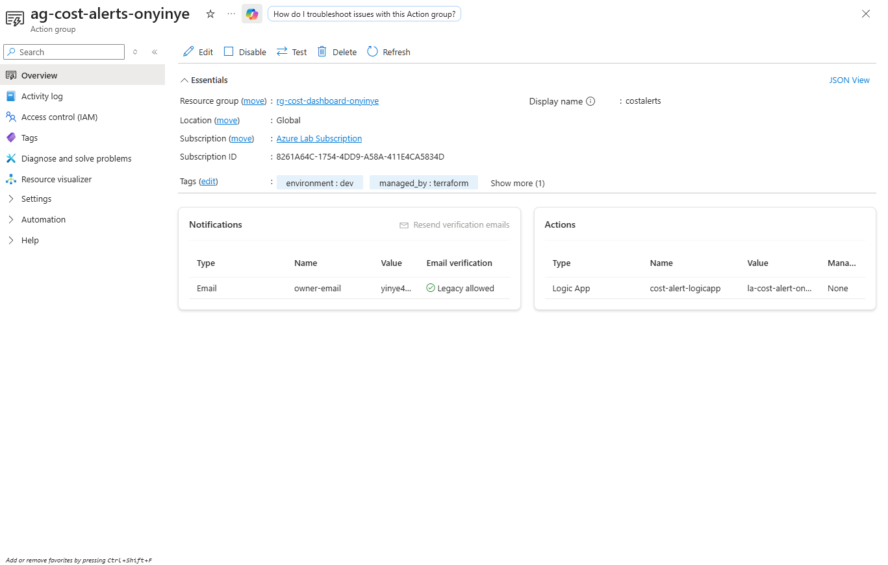
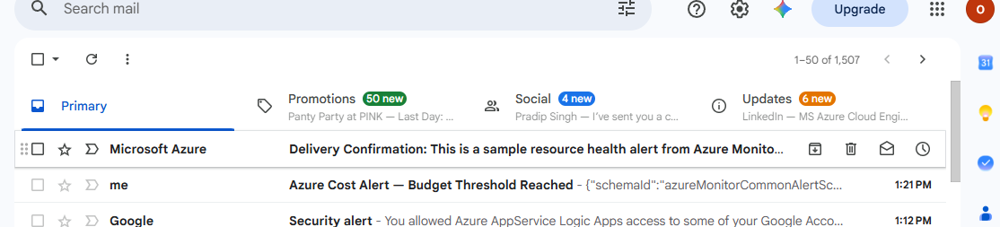
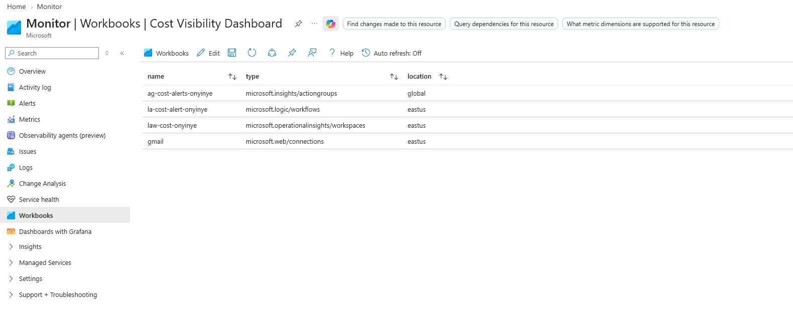

# Azure Cost Visibility Dashboard

## Project Overview

This project builds an Azure cost-governance and monitoring solution using Terraform, Azure Monitor, Cost Management, Logic Apps, Log Analytics, and Azure Workbooks.

The goal is to give cloud owners a simple way to monitor Azure spending, receive notifications before costs become a problem, and maintain visibility into the resources generating spend.

## Business Problem

Cloud billing can be difficult to interpret, especially when costs are spread across multiple services and resource groups.

This project addresses that problem by providing:

- A monthly Azure budget
- Budget alert thresholds at $50, $100, and $200
- Email notifications through an Azure Monitor Action Group
- A Logic App workflow for additional email notification
- Centralized logging through Log Analytics
- An Azure Workbook for resource visibility
- Terraform-based infrastructure deployment

## Architecture

## Technologies Used

- **Microsoft Azure** — Cloud platform used to host the solution
- **Terraform** — Infrastructure as Code for provisioning Azure resources
- **Azure CLI** — Azure authentication and command-line management
- **Azure Cost Management** — Subscription budget and cost governance
- **Azure Monitor** — Monitoring and notification integration
- **Azure Monitor Action Groups** — Budget alert notification routing
- **Azure Logic Apps** — Automated notification workflow
- **Gmail Connector** — Email delivery from the Logic App
- **Log Analytics Workspace** — Centralized subscription activity logs
- **Azure Workbooks** — Dashboard and resource visualization
- **Azure Resource Graph** — Resource inventory and metadata queries
- **Git & GitHub** — Version control and project documentation
- **WSL / Ubuntu** — Local Linux development environment

## Resources Deployed
- **Azure Resource Group** — `rg-cost-dashboard-onyinye`
- **Log Analytics Workspace** — Centralized subscription activity logs
- **Azure Monitor Action Group** — Routes cost-budget notifications
- **Azure Subscription Budget** — Monthly budget of **$200** with alert thresholds at **$50, $100, and $200**
- **Azure Logic App** — Receives the Action Group trigger and sends Gmail notifications
- **Subscription Diagnostic Setting** — Sends Administrative, Security, and Policy activity logs to Log Analytics

## Implementation & Validation

The solution was deployed and validated in Azure. The following screenshots demonstrate the deployed infrastructure, notification workflow, and Workbook resource visibility.

### Terraform Deployment

Terraform state confirms the Azure resources are managed through Infrastructure as Code.

### Azure Resources

The project resources were deployed within the Azure resource group.

### Alerting and Automation

The Azure Monitor Action Group provides two notification paths: direct email notification and the Logic App workflow.

### Notification Test

The Action Group test successfully generated notifications, validating both the direct email path and the Logic App-to-Gmail workflow.

### Cost Visibility Workbook

The Azure Workbook uses Azure Resource Graph to provide visibility into resources associated with the project.

